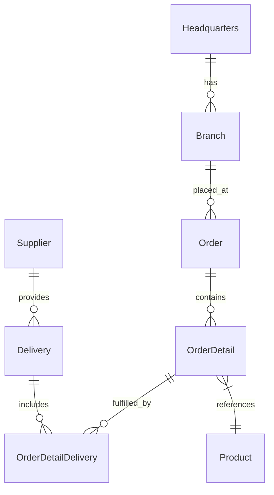
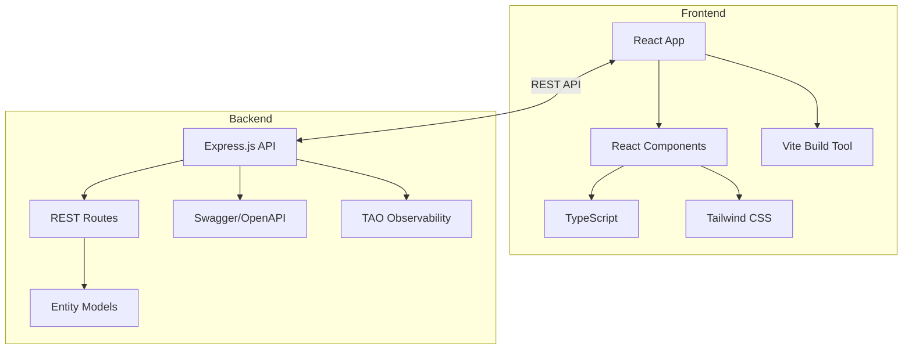

# 🚀 OctoCAT Supply: The Ultimate GitHub Copilot Demo v1.1.3


Welcome to the OctoCAT Supply Chain Management System - a comprehensive demo application designed to showcase the incredible capabilities of GitHub Copilot, GitHub Advanced Security (GHAS), and the power of AI-assisted development!

## 📋 Table of Contents

- [What Makes This Demo Special](#-what-makes-this-demo-special)
- [Project Overview](#-project-overview)
- [Architecture](#️-architecture)
- [Tech Stack](#-tech-stack)
- [Project Structure](#-project-structure)
- [Prerequisites](#-prerequisites)
- [Quick Start](#-quick-start)
- [Installation](#-installation)
- [Building & Running](#️-building--running)
- [Testing](#-testing)
- [Demo Scenarios](#-demo-scenarios)
- [MCP Server Setup](#️-mcp-server-setup)
- [Deployment](#-deployment)
- [Development](#-development)
- [Troubleshooting](#-troubleshooting)
- [Documentation](#-documentation)
- [Contributing](#-contributing)
- [Security](#️-security)

## ✨ What Makes This Demo Special

This isn't just another demo app - it's a carefully crafted showcase that demonstrates the full spectrum of GitHub's AI capabilities:

- 🤖 **Copilot Agent Mode & Vision** - Watch Copilot understand UI designs and implement complex features across multiple files
- 🎭 **MCP Server Integration** - Demonstrate extended capabilities with Playwright for testing and GitHub API integration
- 🛡️ **Security First** - Showcase GHAS scanning and Copilot-powered vulnerability fixes
- 🧪 **Test Generation** - Exhibit Copilot's ability to analyze coverage and generate meaningful tests
- 🔄 **CI/CD & IaC** - Generate deployment workflows and infrastructure code with natural language
- 🎯 **Custom Instructions** - Show how Copilot can be tailored to understand internal frameworks and standards

## 🏢 Project Overview

OctoCAT Supply is a modern supply chain management application built using TypeScript. The entire application was originally created from an ERD diagram and natural language prompts using GitHub Copilot, demonstrating the power of AI-assisted development.

### Key Features
- **Supply Chain Management**: Complete system for managing headquarters, branches, orders, products, suppliers, and deliveries
- **RESTful API**: Comprehensive Express.js API with OpenAPI/Swagger documentation
- **Modern Frontend**: React 18+ application with responsive design using Tailwind CSS
- **Real-time Updates**: Dynamic UI updates and state management
- **Containerization**: Docker support for consistent deployment
- **Testing Suite**: Unit tests with Vitest and integration testing capabilities
- **Security Integration**: GHAS scanning and vulnerability management

## 🏗️ Architecture

The application follows a modern microservices architecture with clear separation of concerns:

### Entity Relationship Diagram


### Component Architecture


## 💻 Tech Stack

### Backend
- **Runtime**: Node.js 18+
- **Framework**: Express.js 4.21+
- **Language**: TypeScript 5.7+
- **API Documentation**: Swagger/OpenAPI 3.0
- **Testing**: Vitest 3.0+ with coverage
- **Build Tool**: TypeScript Compiler (tsc)
- **Development**: tsx for hot reloading

### Frontend  
- **Framework**: React 18.3+
- **Language**: TypeScript 5.7+
- **Build Tool**: Vite 6.2+
- **Styling**: Tailwind CSS 3.3+
- **HTTP Client**: Axios 1.8+
- **State Management**: React Query 3.39+
- **Routing**: React Router DOM 7.4+
- **UI Components**: React Slick for carousels
- **Testing**: Vitest + React Testing Library
- **Linting**: ESLint 9.21+

### DevOps & Infrastructure
- **Containerization**: Docker & Docker Compose
- **Cloud Platform**: Azure Container Apps / Azure Web Apps
- **Infrastructure as Code**: Bicep templates
- **CI/CD**: GitHub Actions workflows  
- **Registry**: Azure Container Registry (ACR)
- **Monitoring**: Azure Log Analytics integration

### Development Tools
- **IDE**: VS Code with configured tasks and debugger
- **Package Manager**: npm with workspaces
- **Code Quality**: ESLint, TypeScript strict mode
- **Git Hooks**: Pre-commit validation
- **Environment**: Codespaces support

## 📁 Project Structure

```
├── 📁 api/                     # Backend Express.js API
│   ├── 📁 src/                 # Source code
│   │   ├── 📁 routes/          # API route handlers
│   │   ├── 📁 models/          # Data models
│   │   └── index.ts            # Main server file
│   ├── 📄 ERD.png             # Entity Relationship Diagram
│   ├── 📄 package.json        # API dependencies
│   ├── 📄 Dockerfile          # API container config
│   └── 📄 vitest.config.ts    # Test configuration
├── 📁 frontend/               # React frontend application
│   ├── 📁 src/                # Source code
│   │   ├── 📁 components/     # React components
│   │   ├── 📁 pages/          # Page components
│   │   ├── 📁 hooks/          # Custom React hooks
│   │   └── 📁 utils/          # Utility functions
│   ├── 📁 public/             # Static assets
│   ├── 📄 package.json        # Frontend dependencies
│   ├── 📄 Dockerfile          # Frontend container config
│   └── 📄 vite.config.ts      # Vite configuration
├── 📁 docs/                   # Documentation
│   ├── 📄 architecture.md     # Detailed architecture
│   ├── 📄 build.md           # Build instructions
│   ├── 📄 demo-script.md     # Demo scenarios
│   ├── 📄 deployment.md      # Deployment guide
│   └── 📁 design/            # UI/UX design assets
├── 📁 infra/                  # Infrastructure as Code
│   ├── 📄 main.bicep         # Main Bicep template
│   └── 📄 configure-deployment.sh # Setup script
├── 📁 .devcontainer/         # Dev container configuration
├── 📁 .github/               # GitHub workflows & settings
├── 📁 .vscode/               # VS Code settings & tasks
├── 📄 docker-compose.yml     # Multi-container orchestration
├── 📄 package.json           # Root workspace configuration
└── 📄 README.md              # This file
```

## 📋 Prerequisites

### Required
- **Node.js** 18 or higher ([Download](https://nodejs.org/))
- **npm** (comes with Node.js, latest version recommended)

### Optional
- **Docker** or **Podman** (for containerization and MCP servers)
- **Azure CLI** (for deployment to Azure)
- **GitHub CLI** (for repository management and deployment setup)

### Development Environment Options
- **VS Code** (recommended - includes configured tasks and debugger)
- **GitHub Codespaces** (fully configured cloud development environment)
- Any TypeScript-compatible IDE

## ⚡ Quick Start

```bash
# 1. Clone the repository
git clone https://github.com/CaroByte/copilot_agent_mode-ubiquitous-couscous-main.git
cd copilot_agent_mode-ubiquitous-couscous-main

# 2. Install dependencies
npm install

# 3. Build the application
npm run build

# 4. Start in development mode
npm run dev
```

The application will be available at:
- **Frontend**: http://localhost:5137
- **API**: http://localhost:3000
- **API Documentation**: http://localhost:3000/api-docs

## 🛠️ Installation

### Method 1: Local Development
```bash
# Clone the repository
git clone https://github.com/CaroByte/copilot_agent_mode-ubiquitous-couscous-main.git
cd copilot_agent_mode-ubiquitous-couscous-main

# Install all dependencies (API + Frontend)
npm install

# Verify installation
npm run build
```

### Method 2: GitHub Codespaces
1. Click the "Code" button on the GitHub repository
2. Select "Codespaces" tab
3. Click "Create codespace on main"
4. The environment will be automatically configured with all dependencies

### Method 3: Docker (Containerized)
```bash
# Clone and navigate to project
git clone https://github.com/CaroByte/copilot_agent_mode-ubiquitous-couscous-main.git
cd copilot_agent_mode-ubiquitous-couscous-main

# Build and run with Docker Compose
docker-compose up --build

# Or run individual containers
docker build -t octocat-api ./api
docker build -t octocat-frontend ./frontend
```

## 🏗️ Building & Running

### Development Mode (Recommended)
```bash
# Start both API and Frontend with hot reloading
npm run dev

# Start individual components
npm run dev:api      # API only (port 3000)
npm run dev:frontend # Frontend only (port 5137)
```

### Production Build
```bash
# Build all components
npm run build

# Build individual components
npm run build --workspace=api      # API only
npm run build --workspace=frontend # Frontend only

# Start in production mode
npm start
```

### VS Code Integration
The project includes configured VS Code tasks and debugger:

1. **Build Tasks** (`Ctrl+Shift+P` → `Tasks: Run Task`):
   - `Build All` - Builds both components
   - `Build API` - Builds API only  
   - `Build Frontend` - Builds frontend only

2. **Debug Configuration** (`Ctrl+Shift+D`):
   - `Start API & Frontend` - Launches both with debugger attached
   - View logs in integrated terminal

### Port Configuration
| Service | Default Port | Environment Variable | 
|---------|-------------|---------------------|
| API | 3000 | `PORT` |
| Frontend | 5137 | `VITE_PORT` |

> **Codespaces Note**: Ensure API port visibility is set to `public` to avoid CORS errors.

## 🧪 Testing

### Running Tests
```bash
# Run all tests
npm run test

# Run API tests only
npm run test --workspace=api

# Run with coverage
npm run test:coverage --workspace=api

# Run specific test file
npm run test src/routes/branch.test.ts --workspace=api
```

### Test Structure
- **API Tests**: Located in `api/src/**/*.test.ts`
  - Uses Vitest framework
  - Includes integration tests for all routes
  - Coverage reporting with @vitest/coverage-v8
  - Supertest for HTTP endpoint testing

### Linting
```bash
# Run ESLint on frontend
npm run lint

# Fix auto-fixable issues
npm run lint --workspace=frontend -- --fix
```

## 🎯 Demo Scenarios

This application is designed to showcase various GitHub Copilot capabilities:

### 1. 🎨 **Vibe Coding**
   - **Objective**: Implement a shopping cart from a design mockup
   - **Demonstrates**: Copilot's ability to analyze UI designs and implement complex features
   - **Skills Shown**: 
     - Multi-file code generation
     - State management implementation
     - Component integration
     - Real-time UI updates

### 2. 🧪 **Automated Testing**
   - **Objective**: Generate comprehensive test coverage
   - **Demonstrates**: Intelligent test generation and BDD practices
   - **Skills Shown**:
     - BDD feature file generation
     - Playwright test creation and execution
     - Unit test coverage enhancement
     - Integration test development

### 3. 🛡️ **Security and Best Practices**
   - **Objective**: Identify and fix security vulnerabilities
   - **Demonstrates**: GHAS integration and security-first development
   - **Skills Shown**:
     - Vulnerability scanning with GHAS
     - Automated security fixes
     - Security best practices implementation
     - Code quality improvements

### 4. 🔄 **DevOps Automation**  
   - **Objective**: Complete CI/CD pipeline setup
   - **Demonstrates**: Infrastructure as Code and deployment automation
   - **Skills Shown**:
     - GitHub Actions workflow generation
     - Bicep/Terraform template creation
     - Container deployment configuration
     - Azure resource provisioning

### 5. ⚙️ **Custom Instructions**
   - **Objective**: Tailor Copilot to understand internal frameworks
   - **Demonstrates**: Customization and personalization capabilities
   - **Skills Shown**:
     - Custom instruction configuration
     - Internal library integration (TAO framework example)
     - Domain-specific code generation
     - Best practices enforcement

## 🛠️ MCP Server Setup (Optional)

Model Context Protocol (MCP) servers extend Copilot's capabilities for advanced demonstrations.

### Prerequisites
- Docker or Podman installed and running
- GitHub Personal Access Token (PAT) with appropriate permissions

### Setup Instructions

1. **Install Docker/Podman**:
   ```bash
   # macOS with Homebrew
   brew install docker
   # or for Podman
   brew install podman
   ```

2. **Configure MCP Servers via VS Code**:
   - Open Command Palette (`Cmd/Ctrl + Shift + P`)
   - `MCP: List servers` → `playwright` → `Start server`
   - `MCP: List servers` → `github` → `Start server`

3. **GitHub MCP Server Configuration**:
   - Create a GitHub PAT with permissions:
     - `repo` (for repository access)
     - `workflow` (for Actions)
     - `read:org` (for organization data)
   - Configure the PAT in VS Code when prompted

### Available MCP Servers
- **Playwright**: Browser automation and testing capabilities
- **GitHub**: Direct GitHub API integration for repository management

### Demo Capabilities with MCP
- Generate `.feature` files for BDD testing
- Launch browser automation with Playwright
- Interact directly with GitHub APIs
- Automated repository management tasks

## 🚀 Deployment

### Quick Deployment to Azure

1. **Prerequisites**:
   ```bash
   # Install required tools
   brew install azure-cli github-cli  # macOS
   
   # Login to services  
   az login
   gh auth login
   ```

2. **Automated Setup**:
   ```bash
   # Run the configuration script
   ./infra/configure-deployment.sh <your-repo-name>
   ```
   
   This script creates:
   - Azure Service Principal with OIDC configuration
   - Resource Groups for staging and production
   - Azure Container Registry
   - GitHub Actions variables and environments

3. **Deploy**:
   - Push to `main` branch triggers automatic deployment
   - Staging deployment happens automatically
   - Production requires manual approval

### Manual Deployment Options

#### Docker Compose (Local)
```bash
docker-compose up --build
```

#### Individual Containers
```bash
# Build images
docker build -t octocat-api ./api
docker build -t octocat-frontend ./frontend

# Run containers
docker run -p 3000:3000 octocat-api
docker run -p 5137:80 octocat-frontend
```

#### Azure Container Apps
See [deployment documentation](./docs/deployment.md) for detailed Azure deployment instructions including:
- Bicep infrastructure templates
- GitHub Actions workflows
- Environment configuration
- OIDC authentication setup

## 💻 Development

### Development Workflow

1. **Setup Development Environment**:
   ```bash
   # Clone and install
   git clone <repo-url>
   cd copilot_agent_mode-ubiquitous-couscous-main
   npm install
   ```

2. **Start Development Servers**:
   ```bash
   # Terminal 1: Start API
   npm run dev:api
   
   # Terminal 2: Start Frontend  
   npm run dev:frontend
   
   # Or use single command for both
   npm run dev
   ```

3. **Make Changes**:
   - API changes: Edit files in `api/src/`
   - Frontend changes: Edit files in `frontend/src/`
   - Hot reloading is enabled for both

4. **Test Changes**:
   ```bash
   # Run tests
   npm run test
   
   # Build to verify
   npm run build
   ```

### Code Quality

- **TypeScript**: Strict mode enabled for type safety
- **ESLint**: Configured for React and TypeScript best practices  
- **Prettier**: Code formatting (via ESLint integration)
- **Vitest**: Fast unit testing with coverage reports

### VS Code Extensions (Recommended)

- GitHub Copilot
- TypeScript and JavaScript Language Features
- ESLint
- Tailwind CSS IntelliSense
- Thunder Client (API testing)
- Docker

## 🔧 Troubleshooting

### Common Issues

#### Build Failures
```bash
# Clear node_modules and reinstall
rm -rf node_modules package-lock.json
rm -rf api/node_modules frontend/node_modules
npm install

# Clear build artifacts
rm -rf api/dist frontend/dist
npm run build
```

#### Port Conflicts
```bash
# Kill processes using default ports
lsof -ti:3000 | xargs kill  # API port
lsof -ti:5137 | xargs kill  # Frontend port
```

#### CORS Issues in Codespaces
1. Ensure API port (3000) visibility is set to `public`
2. Update frontend API URL in environment configuration
3. Check browser console for specific CORS errors

#### Docker Issues
```bash
# Reset Docker environment
docker-compose down --volumes --rmi all
docker system prune -f
docker-compose up --build
```

### Getting Help

1. **Check Documentation**: Review files in `docs/` directory
2. **GitHub Issues**: Create an issue with reproduction steps
3. **Logs**: Check browser console and server logs for error details

## 📚 Documentation

### Core Documentation
- **[Architecture Overview](./docs/architecture.md)** - Detailed system architecture and ERD
- **[Build Instructions](./docs/build.md)** - Comprehensive build and testing guide
- **[Demo Script](./docs/demo-script.md)** - Complete demo scenarios and instructions
- **[Deployment Guide](./docs/deployment.md)** - Azure deployment with Bicep and GitHub Actions

### Additional Resources
- **[TAO Framework](./docs/tao.md)** - Fictional observability framework for demos
- **[Design Assets](./docs/design/)** - UI/UX design mockups and assets
- **API Documentation** - Available at `/api-docs` when running locally

## 🤝 Contributing

### Getting Started
1. Fork the repository
2. Create a feature branch: `git checkout -b feature/amazing-feature`
3. Make your changes following the existing code style
4. Add tests for new functionality
5. Ensure all tests pass: `npm run test`
6. Build successfully: `npm run build`
7. Commit changes: `git commit -m 'Add amazing feature'`
8. Push to branch: `git push origin feature/amazing-feature`
9. Create a Pull Request

### Development Guidelines
- Follow TypeScript best practices
- Maintain test coverage above 80%
- Use semantic commit messages
- Update documentation for new features
- Ensure cross-platform compatibility

### Code Style
- Use TypeScript strict mode
- Follow ESLint configuration
- Use meaningful variable and function names
- Add JSDoc comments for public APIs
- Prefer async/await over Promises

## 🛡️ Security

### Security Features
- **GitHub Advanced Security (GHAS)** integration
- **Dependabot** for dependency vulnerability scanning
- **CodeQL** analysis for code vulnerabilities
- **Secret scanning** to prevent credential leaks

### Reporting Vulnerabilities
Please report security vulnerabilities through GitHub's private vulnerability reporting feature or create a private issue.

### Security Best Practices Demonstrated
- Input validation and sanitization
- CORS configuration
- Secure headers implementation
- Dependency management
- Container security scanning

---

## 🎓 Pro Tips for Solution Engineers

### Demo Preparation
- **Practice First**: Run through demos before customer presentations
- **Be Adaptive**: Copilot is non-deterministic - prepare for variations
- **Know Your Audience**: Mix and match scenarios based on customer interests
- **Have Backup Plans**: Keep alternative approaches ready

### Technical Setup
- **GitHub PAT**: Keep a properly scoped PAT ready for MCP demos
- **Environment**: Test in multiple environments (local, Codespaces, container)
- **Network**: Ensure stable internet for AI model access
- **Fallbacks**: Have pre-built examples ready if live coding fails

### Presentation Tips
- **Start Simple**: Begin with basic Copilot features, then advance
- **Show Process**: Demonstrate the thinking process, not just results  
- **Interactive**: Encourage audience questions and suggestions
- **Real Examples**: Use actual customer scenarios when possible

---

## 📊 Project Status

- ✅ **Core Application**: Complete and functional
- ✅ **API Documentation**: Swagger/OpenAPI integration
- ✅ **Testing Suite**: Unit tests for API routes
- ✅ **Docker Support**: Full containerization
- ✅ **Azure Deployment**: Bicep templates and GitHub Actions
- 🔄 **Frontend Testing**: In development
- 🔄 **E2E Testing**: Playwright integration planned
- 📅 **Mobile Responsive**: Planned enhancement

---

*This entire project, including the hero image, was created using AI and GitHub Copilot! Even this comprehensive README was generated and enhanced by Copilot using the project documentation.* 🤖✨

**Version**: 1.1.3 | **Last Updated**: 2024 | **License**: MIT
